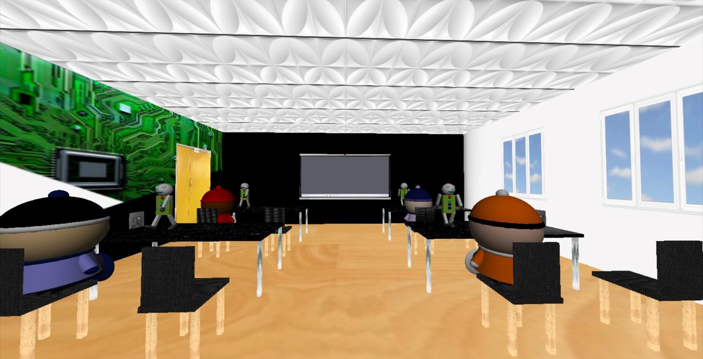

# Virtual Smart Lab - OpenGL Graphics Project



Welcome to the Virtual Smart Lab, an exciting OpenGL graphics project that recreates a realistic virtual scene of a smart lab located in the IT department at the Durban University of Technology's Ritson Campus.

## Features

- Realistic 3D rendering of the Smart Lab.
- Interactive environment with camera control.
- Detailed models of students and robots.
- Seamless navigation and exploration.

## Getting Started

### Prerequisites

- Visual Studio 2022

### Installation

1. Clone this repository:

```bash
git clone https://github.com/DamianGov/Graphics_Project_Smart_Lab.git
